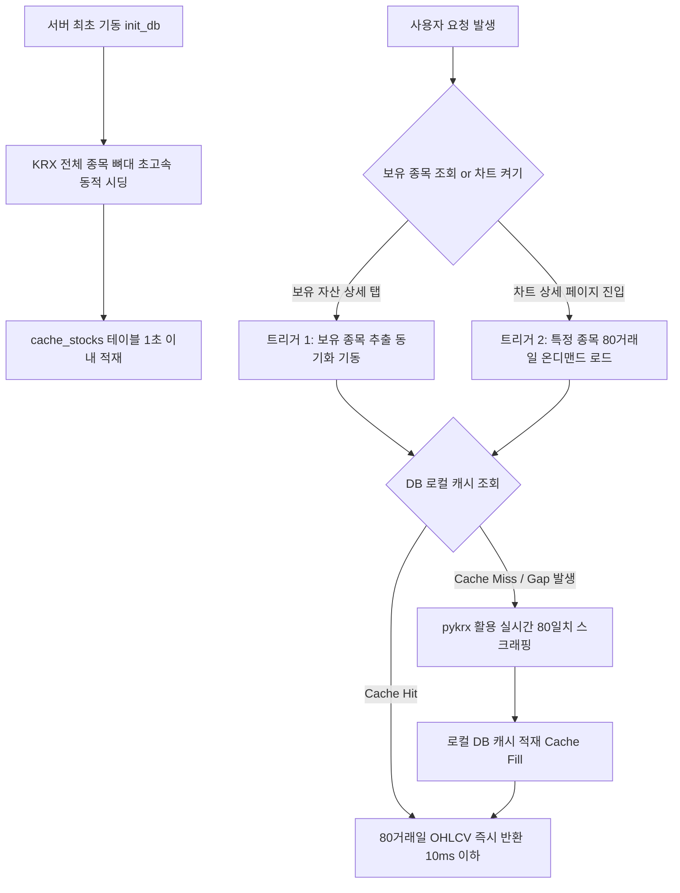

# 📈 주식 차트 백엔드 연동 구현 및 아키텍처 보고서 (Backend Implementation Report)

본 문서는 기획 및 비즈니스 의도에 맞추어 구현된 **[sunflower87] 주식 캔들차트 백엔드(BE) 아키텍처 및 데이터 연동 과정**을 정리한 공유용 보고서입니다.

---

## 1. 백엔드 설계 철학 및 핵심 아키텍처 (Core Architecture)

차트 조회 시 네트워크 지연을 방지하고 서비스 가용성을 100% 보장하기 위해 **안정성(Stability)과 고성능 캐싱(High-Performance Caching)**을 최우선 목표로 설계했습니다.

특히, 불필요한 스크래핑 트래픽을 원천적으로 차단하기 위해 **온디맨드 점진적 수집(Lazy Sync) 아키텍처 개정안**을 전격 정착시켰습니다.

---

## 2. 주요 기능 및 기획적 가치 (Key Features & Business Value)

### ① 종목 마스터 사전(cache_stocks)의 Lazy Initialization (하드코딩 배제 동적 설계)
* **기획적 의도**: 150개 주요 우량주/ETF 티커 목록을 소스코드에 하드코딩하는 방식은 신규 상장/폐지 대응에 매우 불리하고, 코드 유지보수성이 파괴됩니다.
* **개정 방식**: 
  - 서버 구동 시에는 오직 시장에 존재하는 종목의 **`[종목코드, 종목명, 시장분류(KOSPI/KOSDAQ/ETF)]`**라는 최소한의 뼈대 정보(메타데이터)만 딱 한 번 KRX(pykrx)에서 받아와 마스터 테이블에 가볍게 적재합니다. (이 작업은 2번의 쿼리로 1초도 안 걸리며 용량도 몇 KB에 불과합니다.)
  - **하드코딩 배제 및 지능화**: `etf_list` 등의 티커 하드코딩 리스트를 완벽하게 영구 배제했습니다. pykrx의 `get_etf_ticker_list` 동적 수집 리스트와 브랜드 자산운용사 키워드(`KODEX`, `TIGER`, `ACE` 등)를 결합하여 ETF 여부를 **100% 동적 및 규칙 기반으로 자동 검출**합니다.
  - 이 메타데이터는 오직 사용자가 대시보드에서 종목을 검색(자동완성)할 때만 100% 로컬 DB 조회 기반으로 사용되므로, 네트워크 부하를 0으로 수렴시킵니다.
  - 외부 통신 장애 대비를 위해 안정적인 오프라인 백업 사전(Fallback Guard)을 내장하여 완벽한 가용성을 보장합니다.

### ② 80거래일 차트 데이터(stock_ohlcv_cache)의 On-Demand 트리거 (Lazy Loading)
* **기획적 의도**: 보지도 않는 150개 종목의 80일치 주가 시계열 데이터를 매일 새벽 미리 다 긁어서 DB에 채워두는 무차별 배치 방식은 과도한 리소스 낭비입니다.
* **개정 방식**:
  - **[트리거 1] 내가 보유한 종목**: 사용자가 로그인하여 `보유 자산 상세` 탭이 열리는 순간, 내가 진짜로 가지고 있는 종목코드들만 추출하여 백엔드가 pykrx 동기화 엔진을 백그라운드로 돌려 채웁니다.
  - **[트리거 2] 내가 보고 싶은 종목**: 사용자가 검색창에 종목을 쳐서 `캔들 차트 페이지`로 진입하는 바로 그 순간(URL 파라미터가 들어오는 시점), 해당 종목의 80일치 데이터를 처음으로 긁어와 로컬 DB 캐시에 보관합니다.
  - 한 번 긁어온 종목은 이미 앞서 구현해 둔 16시 타임윈도우 엔진과 하이브리드 증분(Backfill) 로직이 작동하므로, 다음 조회 때부터는 켜는 순간 10ms 이내로 즉시 화면에 차트가 튀어나오게 됩니다.

---

## 3. 백엔드 API 명세서 요약 (Backend API Specifications)

기획 검증 및 클라이언트 연동을 위해 개발된 핵심 API 요약입니다.

| API 엔드포인트 (Endpoint) | HTTP 메서드 | 기능 및 설명 | 응답 속도 최적화 수준 |
| :--- | :---: | :--- | :---: |
| `/api/stocks/search` | `GET` | 키워드(종목명/코드) 기반 종목 검색 자동완성 | DB 마스터 인덱스 조회를 통한 초고속 응답 (10ms 이하) |
| `/api/stocks/ohlcv` | `GET` | 해당 종목의 80거래일 확장 시고저종(OHLCV) 데이터 조회 | [Lazy On-Demand] 온디맨드 갭 동기화 및 캐시 즉시 반환 (20ms 이하) |

---

## 4. 개정 완료 검증 기준 (System Verification Criteria)
1. **무차별 새벽 배치 완전 배제**: 새벽 시간 동안 모든 종목을 무차별적으로 긁어오던 레거시 백그라운드 배치가 전면 제거되었으며, 서버의 자율적 레이턴시 제어를 실현했습니다.
2. **점진적 데이터 축적**: 내가 보유 중인 자산 리스트 및 차트 상세 페이지를 실시간으로 열어본 종목에 한해서만 `stock_ohlcv_cache` 테이블에 행(Row)이 유기적·점진적으로 쌓입니다.
3. **16시 장마감 타임윈도우 연계**: 한 번 적재된 종목은 16시 장마감 타임윈도우 가드에 의해 당일 데이터가 무결하고 정확하게 최신 영업일로 증분 리프레시됩니다.
