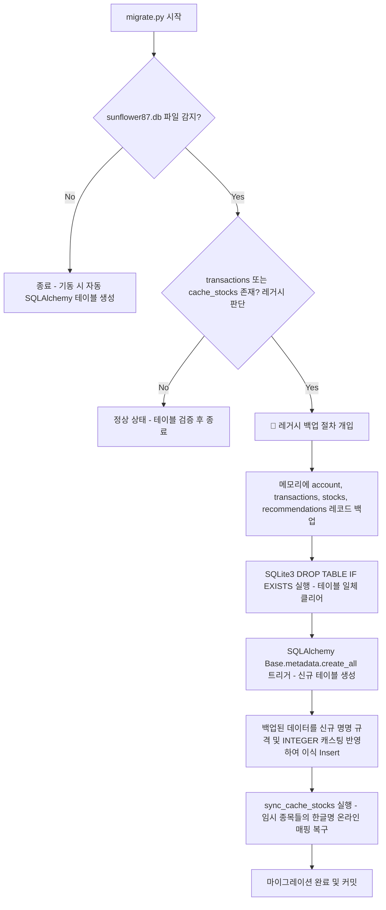

# 💻 DB 개발자 전용 개발 계획서 (Database Developer Plan)

본 계획서는 **sunflower87** 프로젝트 리팩토링 중 데이터베이스 설계 개편, 제3정규화(3NF) 이식, SQL 예약어 회피, 소프트 딜리트 필드 탑재 및 레거시 데이터 마이그레이션 전략을 다루는 DB 개발자 전용 명세서입니다.

---

## 1. 물리 데이터베이스 개편 명세 (3NF & Ledger)

모든 테이블명을 단수형으로 명명하고, 데이터 중복이 없는 3NF 규격과 현금 흐름 감사가 가능한 원장 구조를 도입합니다. SQL 문법 오작동을 유발하는 `date` 및 `type` 예약어 컬럼명을 제거하고 `dt_` 일시 접두어 규칙으로 통일합니다.

### ① 계좌 테이블 (`account`)
개인보유 증권 계좌 정보를 관리합니다.
*   `acc_cd` (계좌코드, `VARCHAR`, **Primary Key**)
*   `acc_nm` (계좌명, `VARCHAR`, Not Null)
*   `acc_company_nm` (증권사명, `VARCHAR`, Not Null)
*   `acc_order` (출력 우선순위, `INTEGER`, Not Null, Default `1`)
*   `cash_balance` (예수금 잔고, `INTEGER`, Not Null, Default `0`)
*   `initial_cash` (투자 원금, `INTEGER`, Not Null, Default `0`)
*   `dt_created` (등록 일시, `DATETIME`, Not Null, Default `utcnow`)
*   `dt_deleted` (삭제 일시, `DATETIME`, Nullable) ➔ 소프트 딜리트 지원

### ② 매매 내역  테이블 (`transaction`)
*기존 `transactions` ➔ `transaction`으로 단수화하며, `date`/`type` 예약어를 탈피하고 중복 `stock_name`을 완전히 제거합니다.*
*   `id` (일련번호, `INTEGER`, **Primary Key**, Auto-Increment)
*   `acc_cd` (소속 계좌코드, `VARCHAR`, **Foreign Key** `account.acc_cd`, Not Null)
*   `dt_trade` (거래 일시, `DATETIME`, Not Null, Default `utcnow`) ➔ 기존 `date` 변환
*   `trade_type` (매매 구분, `VARCHAR`, Not Null) ➔ 기존 `type` 변환 (`BUY`/`SELL`)
*   `stock_code` (종목코드, `VARCHAR`, **Foreign Key** `stock_cache.stock_code`, Not Null) ➔ 기존 `code` 변환
*   `quantity` (매매 수량, `INTEGER`, Not Null)
*   `price` (매매 단가, `INTEGER`, Not Null)
*   `tax_fee` (수수료 및 거래세액, `INTEGER`, Not Null, Default `0`)
*   `dt_deleted` (삭제 일시, `DATETIME`, Nullable) ➔ 소프트 딜리트 지원

### 🚨 ③ 현금 매매 내역  테이블 (`transaction_cash`) [NEW]
*예수금 잔고의 입출금, 이자, 배당 흐름을 감사 추적하기 위해 물리 테이블을 신규 신설합니다.*
*   `id` (일련번호, `INTEGER`, **Primary Key**, Auto-Increment)
*   `acc_cd` (소속 계좌코드, `VARCHAR`, **Foreign Key** `account.acc_cd`, Not Null)
*   `dt_cash` (발생 일시, `DATETIME`, Not Null, Default `utcnow`)
*   `cash_type` (현금 유형, `VARCHAR`, Not Null) ➔ `DEPOSIT`/`WITHDRAW`/`INTEREST`/`DIVIDEND`/`FEE`
*   `amount` (거래 금액, `INTEGER`, Not Null)
*   `description` (상세 적요, `VARCHAR`, Nullable)
*   `dt_deleted` (삭제 일시, `DATETIME`, Nullable) ➔ 소프트 딜리트 지원

### ④ 현재 보유 잔고 테이블 (`stock`)
*기존 `stocks` ➔ `stock`으로 단수화하며, KRW 원화 특성에 알맞도록 평단가와 매수액의 소수점 단위를 완전히 제거하고 `INTEGER`로 정수화 설계합니다.*
*   `stock_code` (종목코드, `VARCHAR`, **Composite Primary Key 1**, **Foreign Key** `stock_cache.stock_code`)
*   `acc_cd` (보유 계좌코드, `VARCHAR`, **Composite Primary Key 2**, **Foreign Key** `account.acc_cd`)
*   `quantity` (보유 수량, `INTEGER`, Not Null)
*   `avg_price` (보유 평단가, `INTEGER`, Not Null) ➔ 기존 `REAL`에서 `INTEGER`로 변경 (소수점 절사 정수화)
*   `current_price` (최근 종가, `INTEGER`, Not Null, Default `0`)
*   `purchase_amount` (매수 총액, `INTEGER`, Not Null, Default `0`) ➔ 기존 `REAL`에서 `INTEGER`로 변경 (정수화)

### ⑤ 종목 마스터 캐시 테이블 (`stock_cache`)
*기존 `cache_stocks` ➔ `stock_cache`로 단수화하며, 한글 종목명 `stock_name` 정보를 보관하는 유일한 SSOT(Single Source of Truth)로 사용합니다.*
*   `stock_code` (종목코드, `VARCHAR`, **Primary Key**)
*   `stock_name` (한글 종목명, `VARCHAR`, Not Null) ➔ **데이터베이스 전체에서 한글명이 보관되는 유일한 필드**
*   `market` (상장 시장 구분, `VARCHAR`, Nullable) ➔ `KOSPI`, `KOSDAQ`, `KONEX`, `ETF`
*   `dt_cached` (캐싱 일시, `DATETIME`, Not Null, Default `utcnow`)
*   `dt_deleted` (삭제/상폐 일시, `DATETIME`, Nullable) ➔ 기존 `is_active` 플래그 제거 후 도입

### ⑥ 주가 OHLCV 캐시 테이블 (`stock_ohlcv_cache`)
*   `stock_code` (종목코드, `VARCHAR`, **Composite Primary Key 1**, **Foreign Key** `stock_cache.stock_code`)
*   `trade_date` (거래일자, `VARCHAR`, **Composite Primary Key 2`) ➔ 형식: `YYYY-MM-DD`
*   `open_price` (시가, `INTEGER`, Not Null)
*   `high_price` (고가, `INTEGER`, Not Null)
*   `low_price` (저가, `INTEGER`, Not Null)
*   `close_price` (종가, `INTEGER`, Not Null)
*   `volume` (거래량, `INTEGER`, Not Null)
*   `trading_value` (거래대금, `INTEGER`, Not Null)
*   `fluctuation_rate` (등락률, `REAL`, Not Null)

### ⑦ AI 추천 종목 테이블 (`recommendation`)
*기존 `recommendations` ➔ `recommendation`으로 단수화하며, AI 추천 기능 확장성에 대비해 맨 하단으로 배치 설계했습니다.*
*   `stock_code` (추천 종목코드, `VARCHAR`, **Primary Key**, **Foreign Key** `stock_cache.stock_code`)
*   `tag` (추천 그룹 태그, `VARCHAR`, Not Null) ➔ 예: `가치주`, `성장주`, `배당주`
*   `reason` (추천 사유, `VARCHAR`, Not Null)
*   `score` (AI 추천 점수, `INTEGER`, Not Null)
*   `dt_recommended` (추천 등록 일시, `DATETIME`, Not Null, Default `utcnow`) [NEW]
*   `dt_deleted` (추천 제외/삭제 일시, `DATETIME`, Nullable) [NEW] ➔ 소프트 딜리트 지원
*   `investor_score` (투자자 피드백 평점, `INTEGER`, Nullable) [NEW] ➔ `0`~`5` 범위 (0: 반려, 1~5: 선호도)

---

## 2. 데이터 보존 점진적 마이그레이션 구현 계획 (`be/migrate.py`)

기존 로컬 개발용 SQLite 파일(`sunflower87.db`)이 이미 존재할 경우, 저장된 실거래 정보 및 사용자 입력 계좌 데이터를 1원도 유실 없이 완전 이식하기 위한 자가 치유형 마이그레이션 스크립트를 작성합니다.

### 🛠️ 세부 마이그레이션 로직 명세
1.  **레거시 스키마 판별**: 스키마 분석기(`sqlalchemy.inspect`)를 가동하여 `"transactions"` 테이블명이 존재할 시 데이터 보존 모드로 진입합니다.
2.  **데이터 임시 백업**: 정밀 수작업 SQLite 쿼리를 기동해 기존 레코드들의 필드를 그대로 메모리에 보관합니다.
3.  **스키마 재구축**: 기존 레거시 테이블들을 완전 드랍하고, SQLAlchemy 모델 선언에 기초해 단수형 물리 스택을 일괄 재생성합니다.
4.  **값 이식 및 타입 복구 캐스팅**:
    *   `transactions` 데이터 이식 시 `date` ➔ `dt_trade`, `type` ➔ `trade_type` 컬럼 매핑.
    *   `stocks` 데이터 이식 시 `avg_price` 및 `purchase_amount` 실수 값을 **정수형(`int(round(val))`)**으로 안전하게 반올림 캐스팅하여 `stock` 테이블에 삽입.
    *   `recommendations` 데이터 이식 시 `recommendation` 테이블에 매핑하고 `dt_recommended`에 마이그레이션 완료 시각 세팅.
5.  **한글명 보존**: Seeder 함수(`sync_cache_stocks`)를 실행시켜 임시 세팅된 `Stock_xxxx` 이름을 한글명 종목 마스터 정보로 교체 완료 처리합니다.
