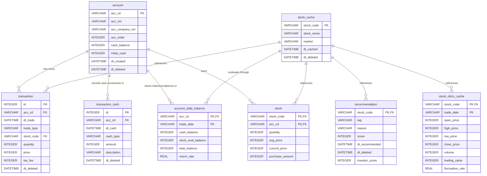

# 🌻 sunflower87 프로젝트 기술 분석 및 리팩토링 설계 명세서 (최종 완성본)

본 문서는 미래에셋 멀티 계좌 관리 및 AI 주식 추천 시스템인 **sunflower87** 프로젝트의 프론트엔드/백엔드 기술 스택, `sunflower87.db` 데이터베이스의 테이블 구조, 그리고 **새롭게 재설계된 전체 REST API 명세**를 정리한 통합 가이드북입니다.

새로운 시작(Refactoring/Rewrite)을 위해 선정한 **3대 핵심 리팩토링 설계안(계좌/현금원장 CRUD 신설, OHLCV 분리, EARTH 규격 강제, DB 3정규화 및 dt_ 일시 접두어 통일 반영)**과 **백엔드 파일 단수화 & REST API 경로 복수화라는 글로벌 업계 표준(Best Practice)**이 완벽하게 반영되어 있습니다.

추가적으로 **실시간 주가 수집(1분 간격 폴링)**, **계좌별 일자별 잔고 원장(`account_daily_balance`) 정산 공식**, 그리고 **데이터베이스 전체 8개 테이블에 대한 완전한 1:1 대칭형 RESTful CRUD API 스펙**이 완벽하게 정리 및 보강 탑재되었습니다.

---

## 1. 프론트엔드 (Frontend) 기술 요약 & 리팩토링 계획

프론트엔드는 현대적인 **React** 개발 프레임워크와 강력한 UI 라이브러리를 활용하여 실시간에 가까운 자산 추적과 고성능 차트를 렌더링하고 있습니다.

### 🛠️ 핵심 스택 & 라이브러리
| 분류 | 기술 / 라이브러리 명칭 | 버전 | 설명 및 주요 용도 |
| :--- | :--- | :--- | :--- |
| **코어 및 빌드** | **React** | `^19.2.6` | 선언적 컴포넌트 모델 기반의 프론트엔드 핵심 UI 라이브러리 |
| | **Vite** | `^8.0.12` | 초고속 HMR(Hot Module Replacement)을 제공하는 최신 빌드 도구 |
| **타입 안정성** | **TypeScript** | `^5.3.3` | 데이터 스키마 타입 안정성 보장 및 정밀 컴파일 검증 |
| **UI 컴포넌트** | **PrimeReact** | `^10.9.8` | 그리드, 카드, 다이얼로그, 테이블 등 엔터프라이즈급 UI 구성요소 |
| **UI 아이콘** | **FontAwesome Free** | `^6.5.1` | 사이드바 메뉴, 계좌 설정, 입출금 상태, 피드백 평점 등 전역 아이콘 수록 |
| **기본 폰트** | **Pretendard** | `^1.3.9` | 폰트. "Pretendard Variable" 사용 |
| **드래그 앤 드롭** | **SortableJS** | `^1.15.2` | 대시보드 카드 순서 드래그 정렬 및 설정 화면의 계좌 순서 정렬 연동 |
| **레이아웃 유틸** | **PrimeFlex** | `^4.0.0` | 유틸리티 퍼스트 CSS 프레임워크 (레이아웃 배치 및 간격 조절용) |
| **스타일링** | **Sass (SCSS)** | `^1.99.0` | 변수, 중첩, 믹스인 등을 지원하는 고성능 CSS 확장 언어 |
| **라우팅** | **React Router Dom** | `^7.15.1` | 멀티 페이지 라우팅 관리 및 중첩 레이아웃 구현 |
| **데이터 시각화** | **ApexCharts** / **react-apexcharts**| `^5.12.0` / `^2.1.0` | 계좌 자산 추이, 주가 차트 등을 동적으로 구현하는 차트 엔진 |
| **인증** | **@react-oauth/google** | `^0.13.5` | Google 계정을 이용한 간편 소셜 로그인 연동 |
| **유틸리티** | **Day.js** | `^1.11.20` | 날짜 데이터 파싱, 포맷팅, 현지화 처리용 경량 라이브러리 |
| **품질 및 코드 포맷**| **Prettier** / **ESLint** | `^3.8.3` / `^10.4.0` | 코드 스타일 표준 준수 및 정적 코드 결함 감지 |

### 📂 Sidebar 메뉴 구성 및 라우팅 맵
좌측에 고정 노출되는 네비게이션 사이드바는 FontAwesome Free 웹 아이콘을 활용하여 일체감 있는 메뉴 세트를 제공합니다.

1. **홈 (Home)** (`/dashboard`)
   - 아이콘: `fa-solid fa-chart-line` / `fa-solid fa-home`
   - 페이지 컴포넌트: `Dashboard.jsx` (대시보드 메인 화면)
2. **보유 자산 상세 (Holdings Detail)** (`/stock?tab=holdings`)
   - 아이콘: `fa-solid fa-briefcase`
   - 페이지 컴포넌트: `StockDetail.jsx` (전체 소유 주식 상세 현황 모니터링 카드 렌더링)
3. **주식 매매 내역 (Stock Transaction)** (`/stock?tab=trade`)
   - 아이콘: `fa-solid fa-exchange-alt`
   - 페이지 컴포넌트: `StockDetail.jsx` (전체 매매 거래 로그 이력 조회 카드 렌더링)
4. **계좌 입출금 내역 (Cash Transaction)** [NEW] (`/stock?tab=cash`)
   - 아이콘: `fa-solid fa-wallet`
   - 페이지 컴포넌트: `StockDetail.jsx` (신설된 `transaction_cash` 테이블의 현금 흐름 변동 이력 조회 카드 렌더링)
5. **설정 (Settings)** [NEW] (사이드바 하단 또는 헤더 호출 버튼 클릭 시 모달 기동)
   - 아이콘: `fa-solid fa-cog`
   - 컴포넌트: `SettingsDialog.jsx` (계좌 우선순위 드래그 리오더링 및 계좌 생성/수정/소프트딜리트 제어 인터페이스)

---

## 2. 백엔드 (Backend) 기술 요약 & 리팩토링 계획

백엔드는 경량화와 빠른 주가 데이터 크롤링을 위해 **Python FastAPI**를 핵심 프레임워크로 채택하였고, 비즈니스 로직을 API 모듈 단위로 고도로 구조화하여 제공합니다.

### 🛠️ 핵심 스택 & 라이브러리
| 분류 | 기술 / 라이브러리 명칭 | 설명 및 주요 용도 |
| :--- | :--- | :--- |
| **웹 프레임워크** | **FastAPI** | 비동기 지원을 기본으로 하는 고성능 Python 웹 프레임워크 |
| **ASGI 서버** | **Uvicorn** | FastAPI API 서빙을 위한 고성능 웹 서버 엔진 |
| **데이터베이스 ORM** | **SQLAlchemy** | 파이썬 객체와 DB 테이블을 매핑해주는 ORM 라이브러리 |
| **주가 데이터 API** | **pykrx** | 한국 거래소(KRX) 네이버/다트의 주가, 시세, 종목 정보를 실시간 수집하는 크롤링 툴킷 |
| **보안 및 환경설정** | **python-dotenv** | `.env` 파일에 기록된 민감 정보(DB URL, API Key) 자동 로드 |
| **품질 및 린터** | **ruff**, **black**, **isort**, **flake8** | 자동 정렬, 코드 포맷팅 및 PEP8 규격 검증 라이브러 세트 |

### 📂 백엔드 모듈 구성 (Routers & Services) - 업계 표준 관례 및 도메인 분리 적용
*   **단일 책임 원칙(SRP) 및 도메인 지향 설계**: 각 API 모듈을 물리적 테이블에 1:1로 매핑하여 격리합니다.
    - `be/routers/stock.py`: 주식 마스터 검색, 상세 한글명 룩업 및 마스터 동기화 전담
    - `be/routers/stock_ohlcv.py`: 대용량 OHLCV 캔들 차트 주가 데이터 캐싱 및 크롤링 전담
    - `be/routers/transaction_cash.py`: 현금 입출금/이자/배당 원장 데이터 CRUD 전담
    - `be/routers/account.py`: 계좌 마스터 CRUD, 시계열 리오더링 및 일자별 잔고 CRUD 제어 전담
    - `be/routers/transaction.py`: 주식 매매 거래 내역 CRUD 전담
    - `be/routers/recommendation.py`: AI 추천 종목 CRUD 및 피드백 전담
    - `be/git/git_task.py` (구 `be/routers/tasks.py` 이동 및 이름 변경): 기획 마크다운 태스크 생성 및 원격 Git 동기화 전담
      - **기능 1**: 지정된 이름과 내용을 기반으로 `docs/tasks` 디렉토리에 마크다운 태스크 파일 물리 작성
      - **기능 2**: 디렉토리 트래버설 공격 방지를 위해 파일명 유효성 정규식 검사(알파뉴메릭, 하이픈, 언더스코어 및 `.md` 확장자 강제)를 수행
      - **기능 3**: `be/git/git_service.py`와 연동하여 태스크 파일을 로컬 Git 리포지토리에 추가 및 커밋(`git commit`) 후 원격 리포지토리에 자동으로 푸시(`git push`)
    - `be/git/git_service.py` (구 `be/git_service.py` 이동): Git 형상관리(`git add`, `git commit`, `git push`) 연동을 전담하는 공통 유틸리티 서비스
    - **[리팩토링] 도메인 서비스 계층(`be/services/`) 신설 및 쪼개기**: 기존 600줄이 넘던 거대한 `be/portfolio.py` 단일 파일을 3개의 마이크로 서비스로 분할하여 단일 책임 원칙(SRP)을 준수합니다.
      - `be/services/market_service.py`: 한국 거래소(KOSPI/삼성전자) 개장 캘린더 동적 조회, 시계열 OHLCV 주가 캐싱, Gap 정제 알고리즘 등 시세 통신 전담
      - `be/services/portfolio_service.py`: 특정 계좌의 거래 연대기 역산 복원, 이동평균법 보유고 산정 및 전체 계좌 포트폴리오 DTO 가공 조립 전담
      - `be/services/dashboard_service.py`: 4대 KPI (오늘/금월/금년/총 누적 수익) 실시간 산출 및 대시보드 데이터 가공 전담
    - `be/routers/dashboard.py` [NEW]: 대시보드 KPI 전용 조회 라우터
*   **파이썬 모듈/파일명 (단수형 및 파이썬 표준 적용)**: 
    - `account.py`, `dashboard.py`, `transaction.py`, `stock.py`, `recommendation.py`, `stock_ohlcv.py`, `transaction_cash.py`, `services/market_service.py`, `services/portfolio_service.py`, `services/dashboard_service.py`, `git/git_task.py`, `git/git_service.py`
*   **REST API 엔드포인트 경로 (복수형 유지)**:
    - `GET /api/accounts`, `POST /api/transactions`, `GET /api/stocks/search`, `GET /api/recommendations`, `GET /api/tasks`, `GET /api/stock_ohlcvs`, `GET /api/transaction_cashes`
*   **🚨 백엔드 공통 상수 관리 ([constants.py](file:///C:/01_projects/sunflower87/be/constants.py))**:
    - `TradeType` (BUY/SELL), `CashType` (DEPOSIT/WITHDRAW/INTEREST/DIVIDEND/FEE), `MarketType` (KOSPI/KOSDAQ/KONEX/ETF)을 선언하여 사용합니다.

---

## 3. 데이터베이스 스키마 설계 & 리팩토링 계획 (일자별 잔고 반영)

`sunflower87.db`는 관계형 데이터베이스인 **SQLite**를 사용하고 있으며, 일관성 있는 **단수형 테이블명 규칙**과 **소프트 딜리트 방식**, **제3정규화(3NF)**에 더해 자산 이력 감사가 가능하고 이름 대칭성이 확보된 **현금 거래 원장(Ledger) 설계**, 그리고 **계좌별 일자별 잔고 테이블**을 완벽히 반영한 총 **8개의 테이블**로 구성되어 있습니다.

### 스키마 리팩토링 반영 명세
1.  **단수형 및 대칭형 명칭 통일**: 모든 테이블명을 단수형으로 통일하며, 거래 장부 테이블 간 완벽한 이름 대칭성을 맞춥니다.
    - `transaction` (주식 매매 거래 내역 테이블)
    - `transaction_cash` (현금 입출금/이자/배당 원장 테이블)
    - `account_daily_balance` (계좌별 일자별 잔고 스냅샷 테이블)
2.  **🚨 예약어(Reserved Keywords) 원천 탈피 및 `dt_` 일시 접두어 명명 통일**
    - SQL 문법에서 오류를 일으키기 쉽고 의미가 모호한 **`date` 및 `type` 컬럼명을 완벽히 제거**하고, 데이터베이스 전체 필드명 통일성(`dt_created`, `dt_deleted`)을 보장하기 위해 일시 정보를 **`dt_` 접두어 형태로 완전히 일치**시킵니다.
3.  **모호한 컬럼 명칭 구체화**: 모든 테이블의 `code`를 직관적인 **`stock_code`**로 일치시켜 조인(JOIN) 가독성을 극대화합니다.
4.  **데이터베이스 제3정규화(3NF) 전면 적용 (중복 이름 완벽 제거)**
    - 여러 테이블(`transaction`, `stock`, `recommendation`)에 중복 저장되던 한글 명칭인 **`stock_name`** 컬럼을 **해당 테이블에서 완전히 제거**합니다.
    - 오직 종목 마스터 테이블인 **`stock_cache`만을 한글 종목명의 단일 원천(SSOT)**으로 삼고 외래키 조인을 통해 동적 해결합니다.
5.  **현금 거래 원장 테이블 (`transaction_cash`) 도입**
    - 예수금(`cash_balance`)에 직접적인 영향을 미치는 비주식 거래 요인을 감사 추적할 수 있도록 전용 원장 테이블을 도입합니다.
6.  **계좌별 일자별 잔고 테이블 (`account_daily_balance`)**
    - 각 계좌의 역사적 일자별 현금 및 보유 주식 평가 자산 총합을 보관하는 시계열 스냅샷 테이블을 생성합니다.

---

## 4. REST API 명세서 (REST API Specifications)

백엔드에서 제공하며 프론트엔드가 호출하는 **전체 8개 테이블 완전 대칭형 RESTful CRUD API 스펙**입니다.

### 💳 ① 계좌 마스터 API 명세 (`/api/accounts`) - `account` 테이블 전용

| Method | Endpoint | Description | Request Parameters / Body | 내부 연계/영향 API (Internal Calls & Impact) | Response Payload (JSON Summary) |
| :---: | :--- | :--- | :--- | :--- | :--- |
| **`GET`** | `/api/accounts` | 활성화된 전체 계좌 목록 조회 | None | 자체 테이블 조회 전용 | `{"status": "success", "accounts": [...]}` |
| **`GET`** | `/api/accounts/{acc_cd}` | 특정 계좌 상세 단일 조회 | **Path**: `acc_cd` | 자체 테이블 조회 전용 | `{"status": "success", "data": {...}}` |
| **`POST`** | `/api/accounts` | 신규 증권 계좌 등록 (Initial Cash 설정) | **Body (JSON)**: `{"acc_cd": "A003", "acc_nm": "개인연금", "acc_company_nm": "미래에셋", "initial_cash": 10000000, "acc_order": 3}` | 자체 테이블 (`account`) 제어 전용 | `{"status": "success", "data": {...}}` *(201 Created)* |
| **`PUT`** | `/api/accounts/{acc_cd}` | 계좌 명칭, 투자 원금 및 순서 정보 수정 | **Path**: `acc_cd` **Body (JSON)**: `{"acc_nm": "연금저축(수정)", "initial_cash": 12000000, "acc_order": 2}` | **`recalculate_portfolio_for_account`** 및 **`daily-balances`** 재계산 연쇄 | `{"status": "success", "data": {...}}` |
| **`DELETE`** | `/api/accounts/{acc_cd}` | 증권 계좌 소프트 딜리트 처리 (목록 제외) | **Path**: `acc_cd` | **`GET /api/accounts`** 호출 시 목록 필터링 연계 | `{"status": "success", "message": "Account deleted successfully."}` |
| **`PUT`** | `/api/accounts/reorder` | `SortableJS` 드래그앤드롭 리오더링에 따른 계좌 우선순위 배치 동기화 | **Body (JSON)**: `acc_orders` 순위 목록 | 자체 테이블 (`account`) 우선순위(`acc_order`) 업데이트 | `{"status": "success", "message": "Account order updated successfully."}` |
| **`GET`** | `/api/accounts/{acc_cd}/performance` | 계좌별 날짜별 잔고 및 누적 수익률 시계열 전송 (서브 차트 연동용) | **Path**: `acc_cd` | **`account_daily_balance`** 테이블에서 직접 초고속 쿼리하여 반환 | `{"status": "success", "performance": [...]}` |

---

### 📝 ② 주식 매매 거래 API 명세 (`/api/transactions`) - `transaction` 테이블 전용

| Method | Endpoint | Description | Request Parameters / Body | 내부 연계/영향 API (Internal Calls & Impact) | Response Payload (JSON Summary) |
| :---: | :--- | :--- | :--- | :--- | :--- |
| **`GET`** | `/api/transactions` | 전체 또는 조건별(계좌, 종목 등) 매매 거래 목록 조회 | **Query Params**: - `acc_cd`: 계좌 필터 - `stock_code`: 종목 필터 | 자체 테이블 (`transaction`) 조회 전용 (내부적으로 `stock_cache` 조인하여 종목명 동적 반환) | `{"status": "success", "data": [{"id": 1, "trade_type": "BUY", ...}]}` |
| **`GET`** | `/api/transactions/{id}` | 특정 매매 거래 단일 상세 조회 | **Path**: `id` | 자체 테이블 조회 전용 | `{"status": "success", "data": {...}}` |
| **`POST`** | `/api/transactions` | 신규 매수/매도 거래 기록 추가 & 자산 실시간 누적 연대기 정산 | **Body (JSON)**: `{"acc_cd": "A001", "dt_trade": "2026-05-23 22:45:00", ...}` | 1. **`portfolio.recalculate_portfolio_for_account`** 실행 2. **`POST /api/accounts/{acc_cd}/recalculate-balances`** 자동 호출 | `{"status": "success", "data": {...}}` *(201 Created)* |
| **`PUT`** | `/api/transactions/{id}` | 특정 매매 로그 수정 및 이전/신규 계좌 포트폴리오 동시 역산 재계산 | **Path**: `id` **Body (JSON)**: 수정할 거래 개체 데이터 | 1. **`portfolio.recalculate_portfolio_for_account`** 실행 2. **`POST /api/accounts/{acc_cd}/recalculate-balances`** 자동 호출 | `{"status": "success", "data": {...}}` |
| **`DELETE`** | `/api/transactions/{id}` | 특정 거래 기록 삭제 및 자산 내역 이전 상태로 정밀 역산 복원(Rollback) | **Path**: `id` | 1. **`portfolio.recalculate_portfolio_for_account`** 실행 2. **`POST /api/accounts/{acc_cd}/recalculate-balances`** 자동 호출 | `{"status": "success", "message": "Transaction deleted & portfolio rolled back."}` |

---

### 💰 ③ 현금 거래 API 명세 (`/api/transaction_cashes`) - `transaction_cash` 테이블 전용

| Method | Endpoint | Description | Request Parameters / Body | 내부 연계/영향 API (Internal Calls & Impact) | Response Payload (JSON Summary) |
| :---: | :--- | :--- | :--- | :--- | :--- |
| **`GET`** | `/api/transaction_cashes` | 특정 계좌의 현금 입출금, 이자 수익, 배당 이력 전체 조회 | **Query Params**: - `acc_cd` (Required): 계좌 필터 | 자체 테이블 (`transaction_cash`) 조회 전용 | `{"status": "success", "data": [{"id": 1, "cash_type": "DIVIDEND", "amount": 50000, ...}]}` |
| **`GET`** | `/api/transaction_cashes/{id}` | 특정 현금 거래 단일 상세 조회 | **Path**: `id` | 자체 테이블 조회 전용 | `{"status": "success", "data": {...}}` |
| **`POST`** | `/api/transaction_cashes` | 입금, 출금, 이자 수익, 주식 배당금 등의 신규 현금 흐름 기록 등록 및 예수금 실시간 재정산 | **Body (JSON)**: `{"acc_cd": "A001", "dt_cash": "2026-05-23 23:12:00", ...}` | 1. **`portfolio.recalculate_portfolio_for_account`** 실행 2. **`POST /api/accounts/{acc_cd}/recalculate-balances`** 자동 호출 | `{"status": "success", "data": {...}}` *(201 Created)* |
| **`PUT`** | `/api/transaction_cashes/{id}` | 특정 현금 거래 명세 및 금액 수정 및 예수금 실시간 재계산 | **Path**: `id` **Body (JSON)**: 수정할 현금 거래 개체 | 1. **`portfolio.recalculate_portfolio_for_account`** 실행 2. **`POST /api/accounts/{acc_cd}/recalculate-balances`** 자동 호출 | `{"status": "success", "data": {...}}` |
| **`DELETE`** | `/api/transaction_cashes/{id}` | 특정 현금 거래 기록 제거 및 예수금 실시간 역산 복원 | **Path**: `id` | 1. **`portfolio.recalculate_portfolio_for_account`** 실행 2. **`POST /api/accounts/{acc_cd}/recalculate-balances`** 자동 호출 | `{"status": "success", "message": "Cash transaction deleted & balance recalculated."}` |

---

### 🚨 ④ 계좌 일자별 잔고 API 명세 (`/api/accounts/{acc_cd}/daily-balances`) - `account_daily_balance` 테이블 전용
*일자별 잔액 스냅샷 테이블의 정량적 회계 감사 및 특수 데이터 조작/재조정을 위한 전용 CRUD API 세트입니다.*

| Method | Endpoint | Description | Request Parameters / Body | 내부 연계/영향 API (Internal Calls & Impact) | Response Payload (JSON Summary) |
| :---: | :--- | :--- | :--- | :--- | :--- |
| **`GET`** | `/api/accounts/{acc_cd}/daily-balances` | 계좌별 날짜별 잔고 목록 시계열 조회 (성능 분석 연동) | **Path**: `acc_cd` **Query Params**: - `start_date` / `end_date` | `account_daily_balance` 스냅샷 테이블 조회 | `{"status": "success", "data": [{"trade_date": "2026-05-20", ...}]}` |
| **`GET`** | `/api/accounts/{acc_cd}/daily-balances/{trade_date}` | 계좌별 특정 날짜의 단일 잔고 스냅샷 조회 | **Path**: `acc_cd`, `trade_date` | `account_daily_balance` 스냅샷 테이블 조회 | `{"status": "success", "data": {...}}` |
| **`POST`** | `/api/accounts/{acc_cd}/daily-balances` | 계좌별 특정 날짜의 커스텀 잔고 스냅샷 강제 생성/주입 (임의 회계 조정용) | **Path**: `acc_cd` **Body (JSON)**: `{"trade_date": "2026-05-24", "cash_balance": 5000000, "stock_eval_balance": 5000000, "total_balance": 10000000, "return_rate": 0.0}` | `account_daily_balance`에 커스텀 강제 레코드 등록 | `{"status": "success", "data": {...}}` *(201 Created)* |
| **`PUT`** | `/api/accounts/{acc_cd}/daily-balances/{trade_date}` | 계좌별 특정 날짜의 잔고 스냅샷 수치 수정 (세부 보정용) | **Path**: `acc_cd`, `trade_date` **Body (JSON)**: 수정할 잔고 정보 | `account_daily_balance` 타겟 영업일 데이터 갱신 | `{"status": "success", "data": {...}}` |
| **`DELETE`** | `/api/accounts/{acc_cd}/daily-balances/{trade_date}` | 계좌별 특정 날짜의 잔고 스냅샷 레코드 삭제 | **Path**: `acc_cd`, `trade_date` | `account_daily_balance` 타겟 영업일 레코드 삭제 | `{"status": "success", "message": "Daily balance record deleted successfully."}` |
| **`POST`** | `/api/accounts/{acc_cd}/recalculate-balances` | 계좌 거래 대장을 바탕으로 최초일부터 오늘까지의 일자별 잔액 완전 자동 재생성/재구성 (자가치유) | **Path**: `acc_cd` | `transaction` 및 `transaction_cash`를 chronologically 역산해 `account_daily_balance` 전체 테이블 재생성 | `{"status": "success", "message": "Daily balances recalculated successfully."}` |

---

### 📦 ⑤ 보유 잔고 API 명세 (`/api/stocks`) - `stock` 테이블 전용
*계좌별 현재 보유 잔고 목록 조회, 수동 등록, 인라인 수정 및 수동 삭제를 지원하는 온디맨드 CRUD입니다.*

| Method | Endpoint | Description | Request Parameters / Body | 내부 연계/영향 API (Internal Calls & Impact) | Response Payload (JSON Summary) |
| :---: | :--- | :--- | :--- | :--- | :--- |
| **`GET`** | `/api/stocks` | 전체 계좌 또는 특정 계좌의 보유 잔고 목록 조회 | **Query Params**: - `acc_cd`: 계좌 필터 (선택) | 자체 테이블 (`stock`) 및 종목 마스터 조인 룩업 | `{"status": "success", "data": [{"stock_code": "005930", "stock_name": "삼성전자", ...}]}` |
| **`GET`** | `/api/stocks/{acc_cd}/{stock_code}` | 특정 계좌 소속의 특정 종목 보유고 단일 조회 | **Path**: `acc_cd`, `stock_code` | 자체 테이블 조회 및 마스터 조인 | `{"status": "success", "data": {...}}` |
| **`POST`** | `/api/stocks` | 임의 보유 잔고 레코드 수동 생성 (오프라인/레거시 마스터 이식용) | **Body (JSON)**: `{"acc_cd": "A001", "stock_code": "005930", "quantity": 100, "avg_price": 75000, "current_price": 78000, "purchase_amount": 7500000}` | `stock`에 수동 보유고 강제 주입 | `{"status": "success", "data": {...}}` *(201 Created)* |
| **`PUT`** | `/api/stocks/{acc_cd}/{stock_code}` | 특정 보유 잔고 수치 수동 편집 | **Path**: `acc_cd`, `stock_code` **Body (JSON)**: 수정할 수량 및 평단가 정보 | `stock` 보유 정보 편집 및 평가금 재연산 | `{"status": "success", "data": {...}}` |
| **`DELETE`** | `/api/stocks/{acc_cd}/{stock_code}` | 특정 보유 잔고 삭제 (포트폴리오 강제 초기화용) | **Path**: `acc_cd`, `stock_code` | `stock` 보유 정보 영구 삭제 | `{"status": "success", "message": "Stock holding record deleted."}` |

---

### 🏷️ ⑥ 종목 마스터 API 명세 (`/api/stocks/master` 외) - `stock_cache` 테이블 전용
*로컬 로딩 자동완성용 마스터 딕셔너리 정보에 대한 세부 CRUD 명세입니다.*

| Method | Endpoint | Description | Request Parameters / Body | 내부 연계/영향 API (Internal Calls & Impact) | Response Payload (JSON Summary) |
| :---: | :--- | :--- | :--- | :--- | :--- |
| **`GET`** | `/api/stocks/search` | 부분 검색 키워드 기반 동적 종목 초고속 인메모리식 자동완성 검색 | **Query Params**: `keyword` | 자체 테이블 (`stock_cache`) 조회 | `{"status": "success", "results": [...]}` |
| **`GET`** | `/api/stocks/lookup` | 6자리 주식 코드로 한글 종목명 매핑 조회 | **Query Params**: `code` | `stock_cache` 캐시 미스 시 외부 pykrx 조회 | `{"status": "success", "code": "005930", "name": "삼성전자"}` |
| **`POST`** | `/api/stocks/sync-master` | 수동 종목 마스터 강제 재크롤링 및 로컬 마스터 캐시 최신화 | None | 자체 테이블 (`stock_cache`) 갱신 및 시딩 | `{"status": "success", "message": "종목 마스터 수집이 완료되었습니다."}` |
| **`POST`** | `/api/stocks/master` | 커스텀 종목 마스터 레코드 수동 생성 | **Body (JSON)**: `{"stock_code": "999999", "stock_name": "커스텀자산", "market": "ETF"}` | `stock_cache`에 강제 적재 | `{"status": "success", "data": {...}}` *(201 Created)* |
| **`PUT`** | `/api/stocks/master/{stock_code}` | 커스텀 종목 마스터 정보 수정 (한글명 변경 등) | **Path**: `stock_code` **Body (JSON)**: 수정할 종목 정보 | `stock_cache` 정보 변경 | `{"status": "success", "data": {...}}` |
| **`DELETE`** | `/api/stocks/master/{stock_code}` | 종목 마스터 레코드 소프트 딜리트 | **Path**: `stock_code` | `stock_cache` 내 `dt_deleted` 필드 갱신 | `{"status": "success", "message": "Master stock deleted."}` |

---

### 📊 ⑦ 주가 OHLCV(등락률, 거래대금 포함) API 명세 (`/api/stock_ohlcvs` 외) - `stock_ohlcv_cache` 전용 (EARTH 규격)
*시고저종 캐시 주가 데이터에 대한 조회, 수동 등록, 임의 편집 및 개별 삭제를 지원하는 CRUD입니다.*

| Method | Endpoint | Description | Request Parameters / Body | 내부 연계/영향 API (Internal Calls & Impact) | Response Payload (JSON Summary) |
| :---: | :--- | :--- | :--- | :--- | :--- |
| **`GET`** | `/api/stock_ohlcvs` | 특정 종목의 과거 시계열 조회 (즉시 캐시 고속 반환 후 BackgroundTasks 크롤러 백그라운드 수집 실행) | **Query Params**: `code`, `start_date`, `end_date` | `FastAPI BackgroundTasks` 및 `pykrx` 연계 백필 작동 | `{"status": "success", "data": [...]}` |
| **`GET`** | `/api/stock_ohlcvs/{stock_code}/{trade_date}` | 특정 종목의 특정 영업일 OHLCV 단일 행 상세 조회 | **Path**: `stock_code`, `trade_date` | `stock_ohlcv_cache` 단일 조회 | `{"status": "success", "data": {...}}` |
| **`POST`** | `/api/stock_ohlcvs` | 특정 일자의 주가(등락률, 거래대금 포함) 임의 생성/입력 (수동 주가 정보 주입) | **Body (JSON)**: `{"stock_code": "005930", "trade_date": "2026-05-24", "open_price": 78000, "high_price": 79000, "low_price": 77500, "close_price": 78500, "volume": 120000, "trading_value": 9420000000, "fluctuation_rate": 1.29}` | `stock_ohlcv_cache`에 레코드 수동 주입 | `{"status": "success", "data": {...}}` *(201 Created)* |
| **`PUT`** | `/api/stock_ohlcvs/{stock_code}/{trade_date}` | 특정 일자의 주가 정보 수정 | **Path**: `stock_code`, `trade_date` **Body (JSON)**: 수정할 시고저종, 거래량, 거래대금, 등락률 수치 | `stock_ohlcv_cache` 해당 일자 데이터 수정 | `{"status": "success", "data": {...}}` |
| **`DELETE`** | `/api/stock_ohlcvs/{stock_code}/{trade_date}` | 특정 일자의 주가 캐시 레코드 삭제 | **Path**: `stock_code`, `trade_date` | `stock_ohlcv_cache` 해당 일자 레코드 삭제 | `{"status": "success", "message": "OHLCV cache record deleted."}` |
| **`POST`** | `/api/stock_ohlcvs/current` | 보유한 모든 주식의 실시간 현재가 외부 수집 및 DB 캐시 1분 간격 동기화 | None | 네이버 금융 Polling API 연동 및 보유주식 current_price 갱신 | `{"status": "success", "updated": [...]}` |

### 🚀 [신설] 로그인 상태 1분 단위 주가 실시간 연쇄 동기화 시스템 (투트랙 전략 & Trigger-and-Refetch Pattern)
*   **실시간 주가 수집의 한계 돌파 (투트랙 전략 도입)**: `pykrx` 오픈소스는 장중 실시간 데이터 수집이 불가능하고 잦은 호출 시 IP가 차단되는 한계가 있습니다. 이를 해결하기 위해 백엔드의 데이터 수집을 두 가지 트랙으로 분리합니다.
    - **트랙 1 (실시간 당일 시·고·저·종·거래량)**: `POST /api/stock_ohlcvs/current` 호출 시 **네이버 금융 모바일 Polling API**(`https://polling.finance.naver.com/api/realtime/domestic/stock/${종목코드}`)를 직접 호출(Piggybacking)하여 0.1초 만에 장중 100% 실시간 주가 데이터를 가져옵니다. 별도 API Key가 필요 없습니다.
    - **트랙 2 (과거 데이터 및 마스터)**: 차트용 과거 데이터 및 종목 마스터 수집 등은 기존과 동일하게 강력한 **`pykrx`**를 사용합니다.
*   **실시간 동기화 작동 메커니즘**:
    1.  **FE 백그라운드 주기적 트리거**: 사용자가 로그인 상태일 때, 프론트엔드는 React Context 또는 `useEffect` 내의 `setInterval` 타이머를 통해 **1분 간격**으로 백엔드의 실시간 주가 동기화 API(`POST /api/stock_ohlcvs/current`)를 호출(Trigger)합니다.
    2.  **BE 주가 수집 및 적재**: 백엔드는 수량이 `quantity > 0`인 보유 종목들을 판별해 **네이버 금융 Polling API**로 실시간 주가를 고속 수집하고, `stock` 테이블의 `current_price`를 업데이트한 뒤 성공 결과를 응답합니다.
    3.  **FE 연쇄적 상태 리밸리데이션 (Refetch)**: 프론트엔드는 `current` API 응답이 성공적으로 리턴되는 즉시, 연쇄적으로 메인 계좌/자산 정보 조회 API (`GET /api/accounts`)를 백그라운드 호출하여 React의 전역 자산 상태(`accounts`, `total_asset` 등)를 즉각 무효화 및 재조회(Refetch)합니다.
*   **기대 효과**: 사용자는 새로고침 버튼을 일체 누르지 않아도 장중에 화면상의 주가 배지, 평가 금액, 평가 손익률, 통합 총자산 수치들이 1분마다 살아있는 대시보드처럼 **실시간으로 완벽히 연쇄 반영**되어 미려하게 렌더링되는 최고급 사용자 경험(UX)을 제공받게 됩니다.

---

### 🤖 ⑧ AI 추천 API 명세 (`/api/recommendations` 외) - `recommendation` 테이블 전용
*추천 종목 목록 조회, 수동 등록, 추천 사유 편집, 소프트 딜리트 및 투자자 의견 피드백 반영을 담은 CRUD입니다.*

| Method | Endpoint | Description | Request Parameters / Body | 내부 연계/영향 API (Internal Calls & Impact) | Response Payload (JSON Summary) |
| :---: | :--- | :--- | :--- | :--- | :--- |
| **`GET`** | `/api/recommendations` | 오늘 날짜 기준 AI 포트폴리오 권장 추천 종목 목록 조회 | None | 자체 테이블 조회 및 `stock_cache` 조인 | `{"status": "success", "data": [...]}` |
| **`GET`** | `/api/recommendations/{stock_code}` | 특정 AI 추천 종목 단일 상세 조회 | **Path**: `stock_code` | 자체 테이블 조회 및 마스터 조인 | `{"status": "success", "data": {...}}` |
| **`POST`** | `/api/recommendations` | 신규 AI 추천 종목 등록 | **Body (JSON)**: `{"stock_code": "000660", "tag": "가치주", "reason": "반도체 업황 개선 기대", "score": 95}` | `recommendation`에 수동 데이터 적재 | `{"status": "success", "data": {...}}` *(201 Created)* |
| **`PUT`** | `/api/recommendations/{stock_code}` | 추천 내용/사유/점수 수정 | **Path**: `stock_code` **Body (JSON)**: 수정할 내용 정보 | `recommendation` 정보 갱신 | `{"status": "success", "data": {...}}` |
| **`DELETE`** | `/api/recommendations/{stock_code}` | 추천 종목 소프트 딜리트 (삭제 타임스탬프 마킹) | **Path**: `stock_code` | `recommendation` 내 `dt_deleted` 필드 갱신 | `{"status": "success", "message": "Recommendation soft-deleted."}` |
| **`PATCH`** | `/api/recommendations/{stock_code}/feedback` | 투자자가 AI의 종목 추천에 대해 의견 피드백 점수(0~5) 부여 | **Path**: `stock_code` **Body (JSON)**: `{"investor_score": 5}` (0: 반려, 1~5: 선호도) | 피드백 반영 및 0점일 시 즉시 소프트 딜리트 연쇄 | `{"status": "success", "message": "Feedback submitted."}` |

---

## 5. 데이터 관계도 (ERD) - 🚨 일자별 잔고 테이블 반영

